# DEV-01, Gather references
### Tags: []
### Link:[<https://linkandorf.tumblr.com/post/179024177146/day-11-using-today-to-get-caught-back-up-with-the>]

## References

## Basic Shapes

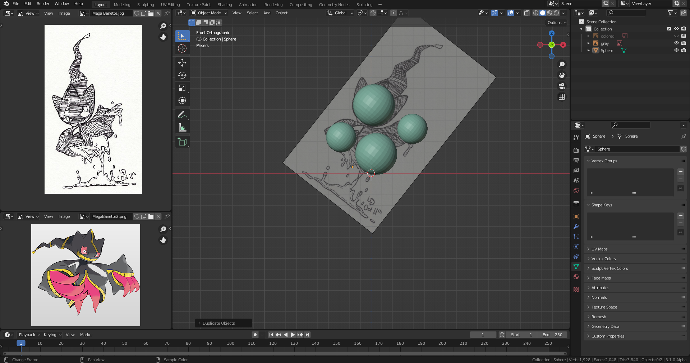

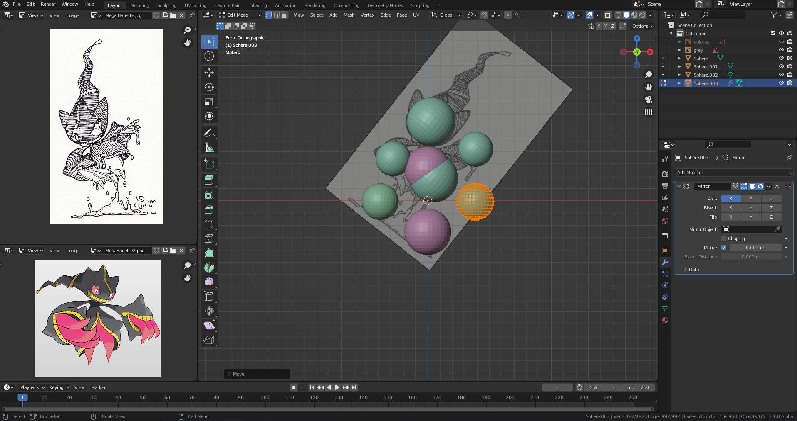

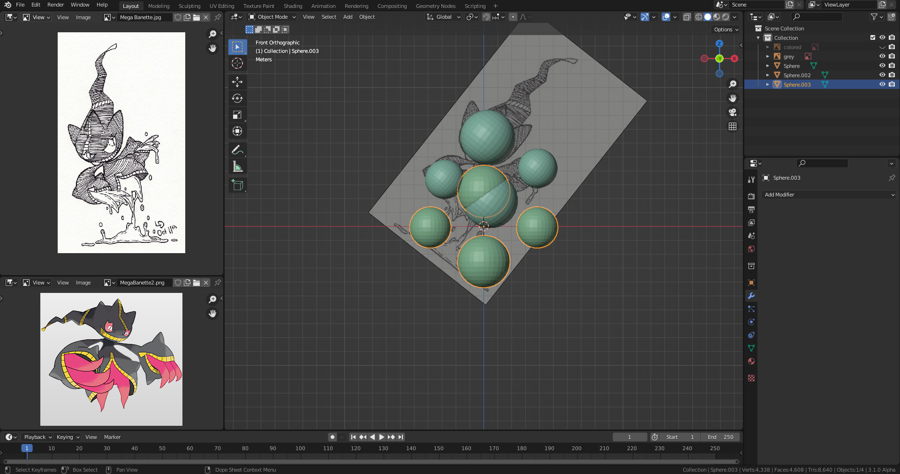

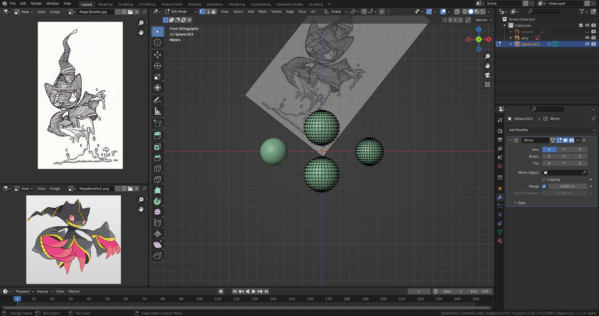

## Use Skin Mod

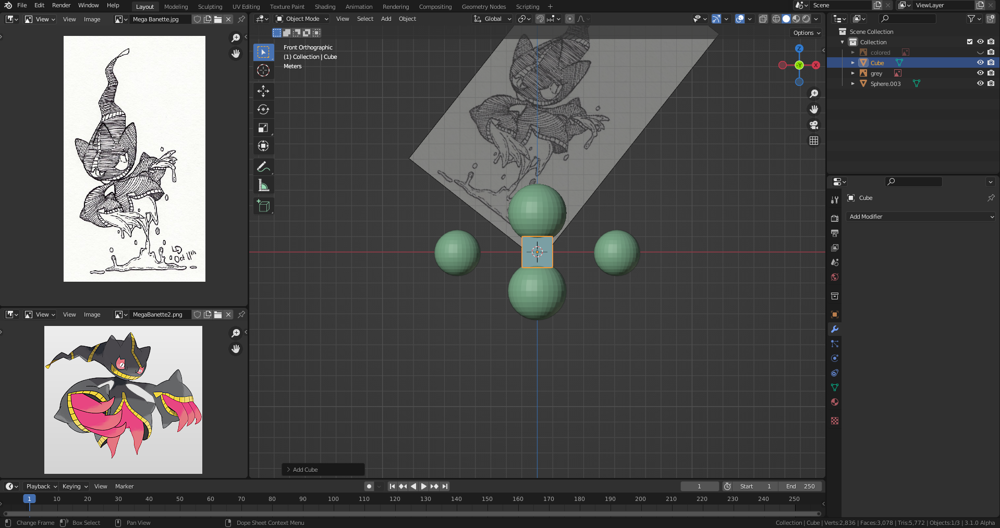

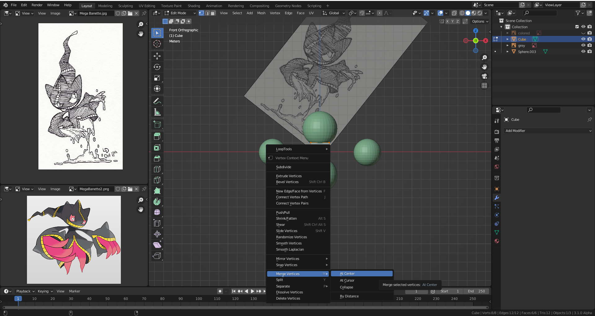

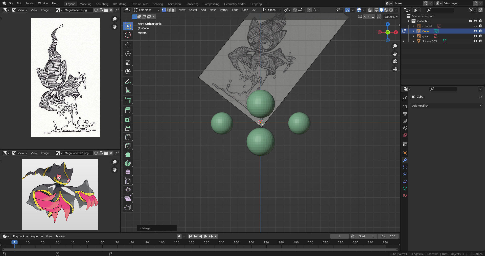

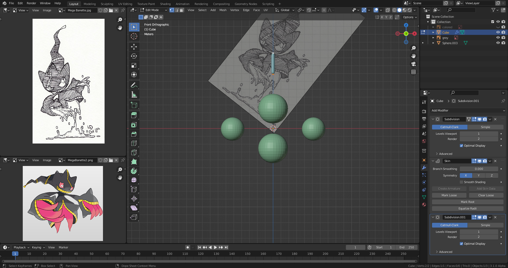

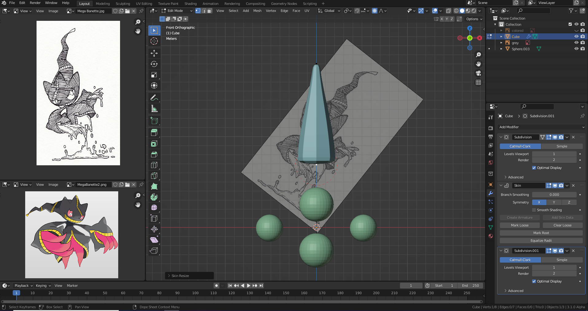

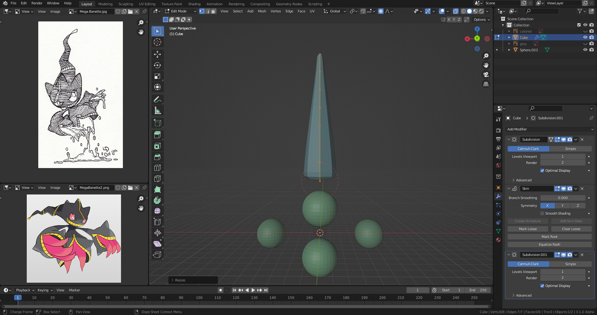

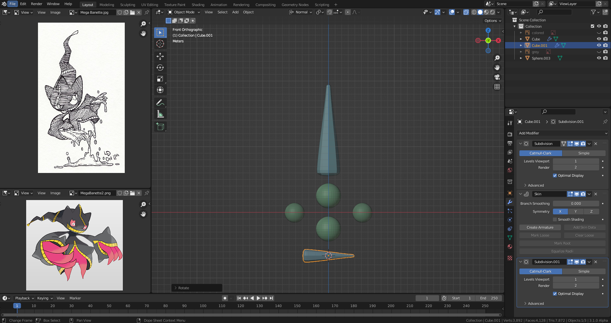

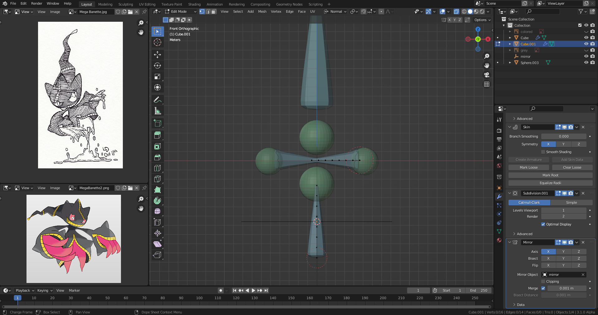

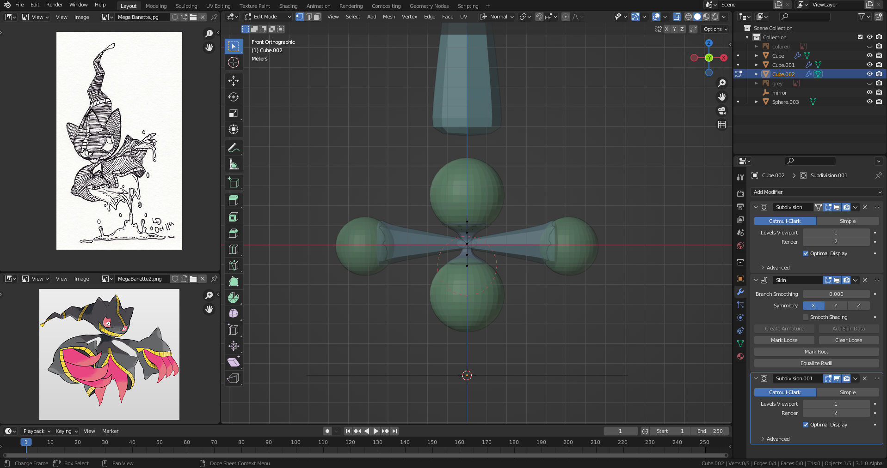

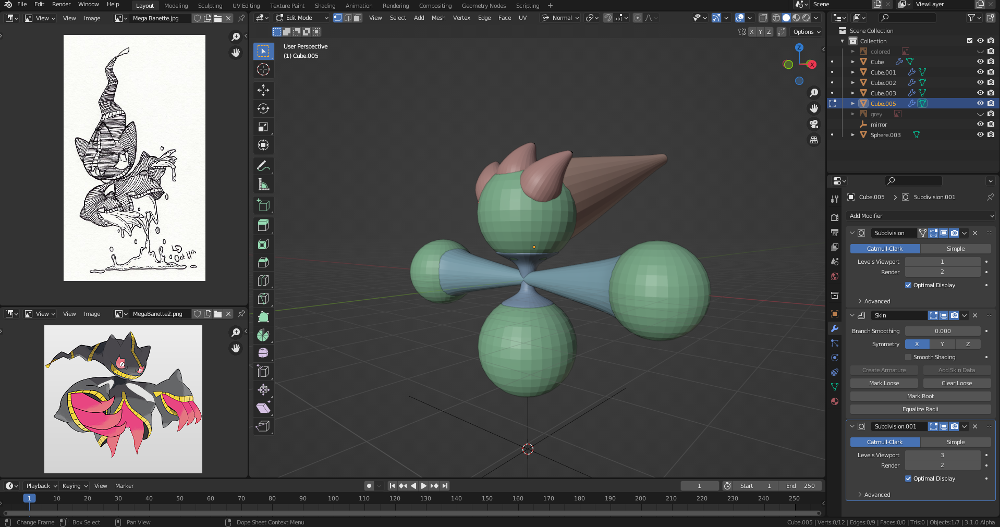

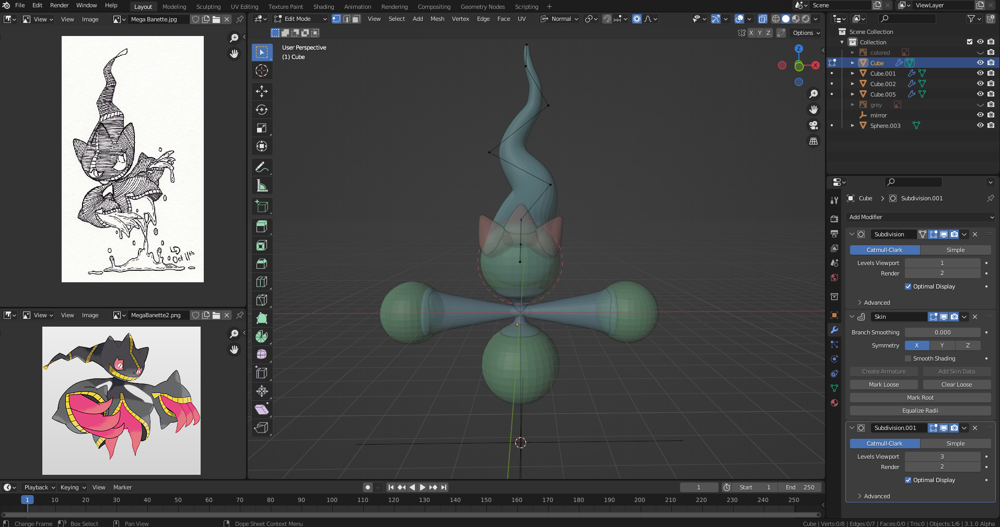

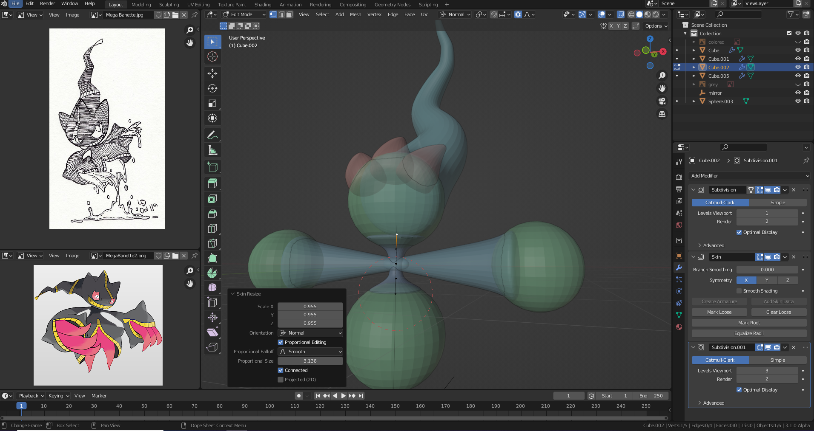

