# DEV-06, Add Zippers
### Tags: []
### Link:[<>]

## Creating Zippers

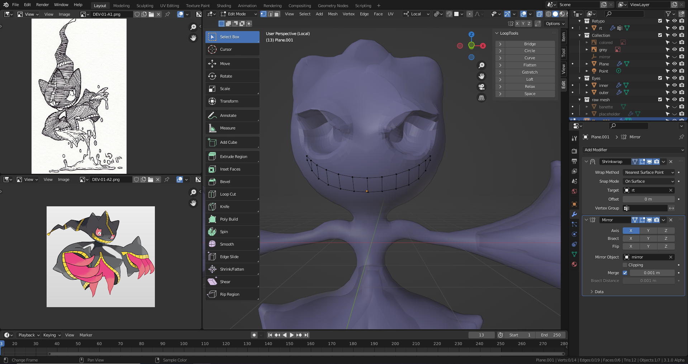

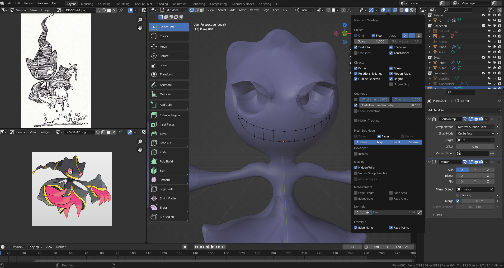

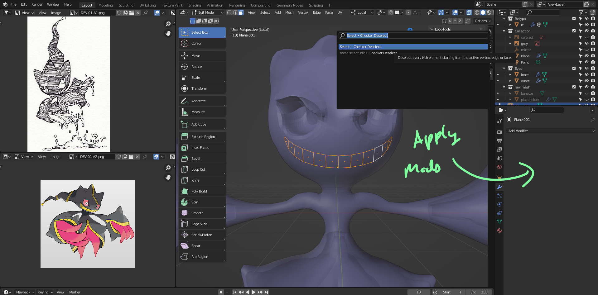

  Checker deselect via F3 and then extrude by .05

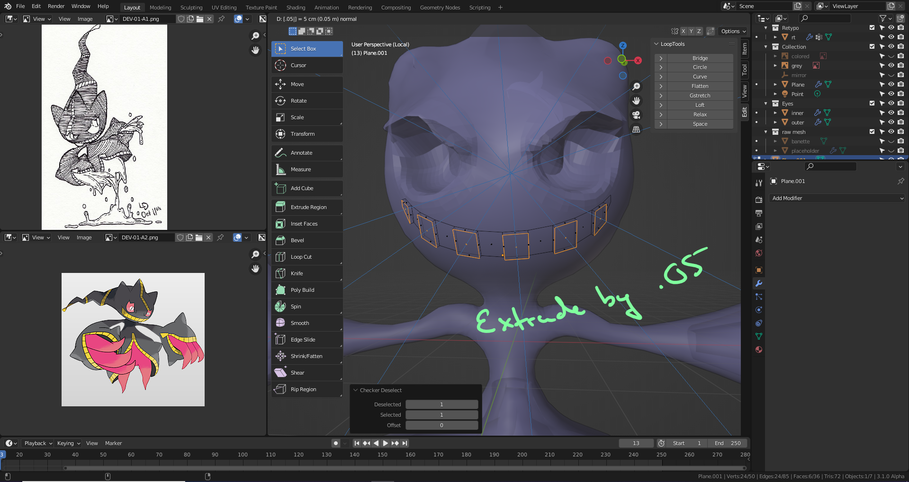

  Do again for the unselected

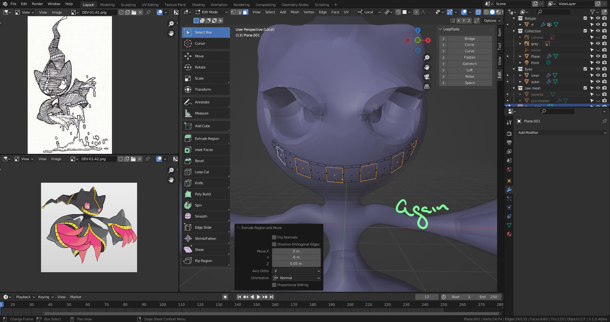

  Disregard n gon comment, made it work for now.

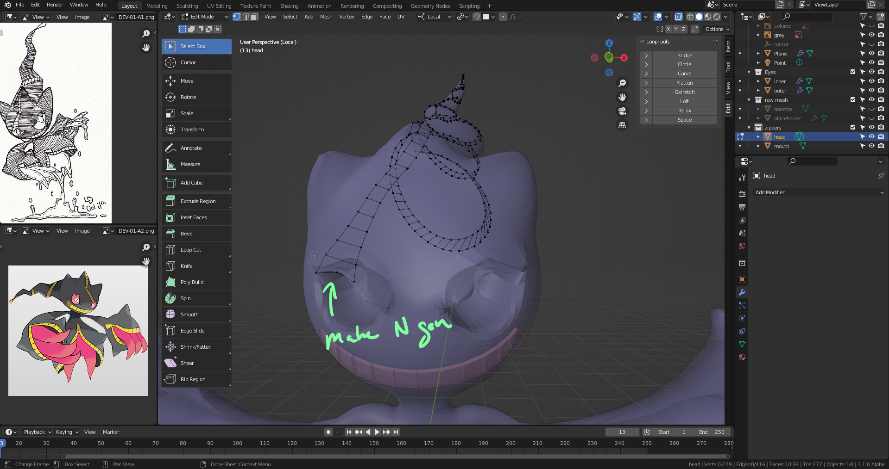

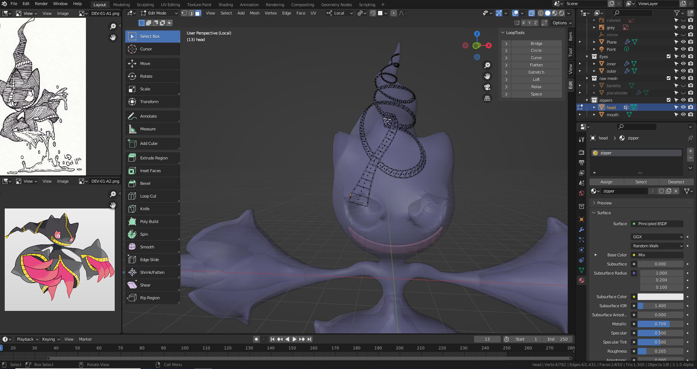

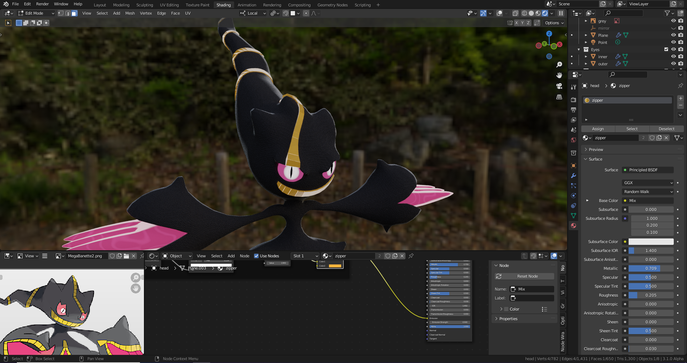

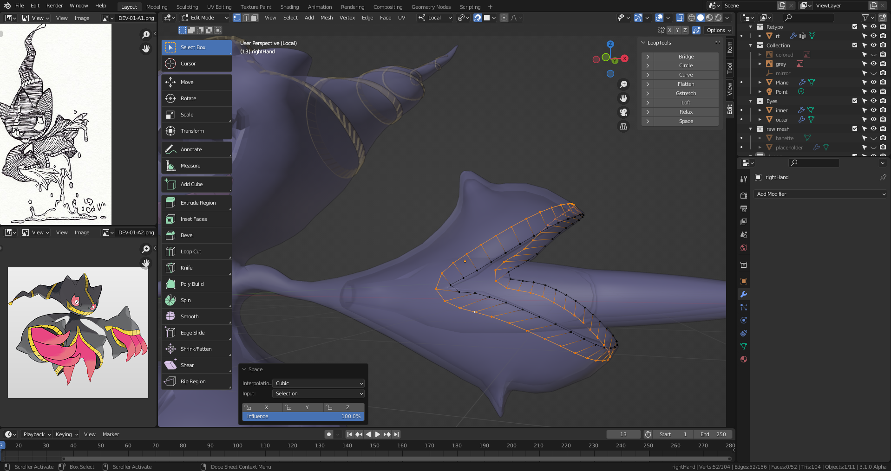

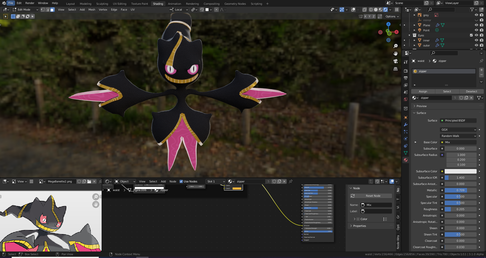

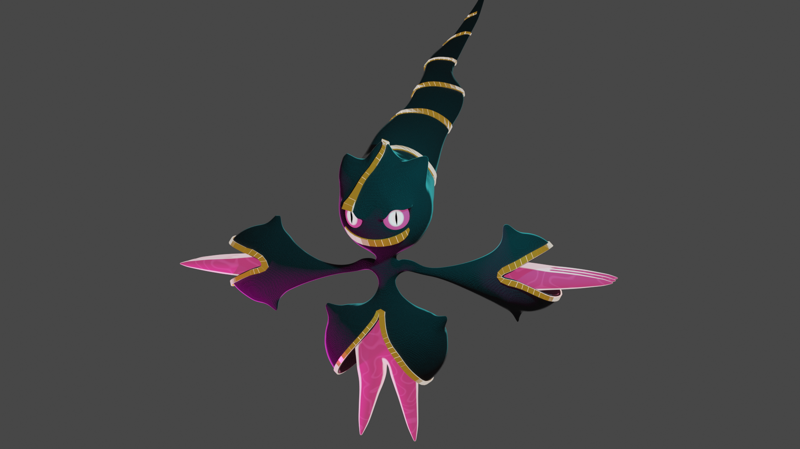
