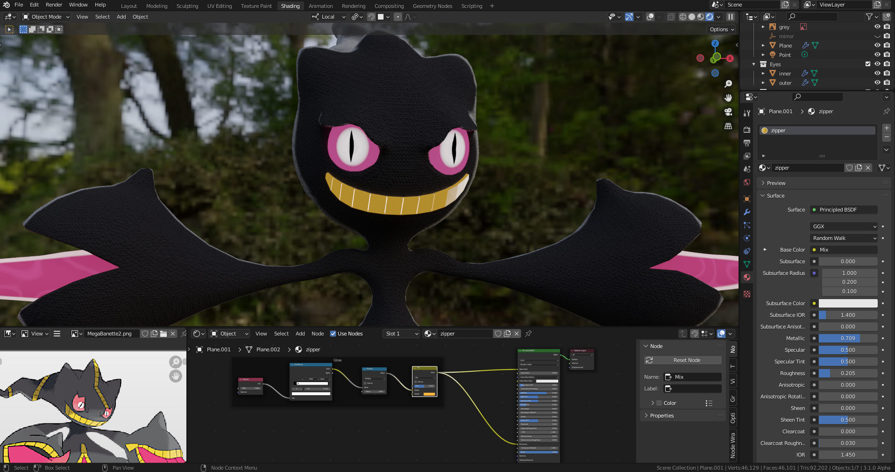

# DEV-06, Add Zippers
### Tags: []
### Link:[<>]

## Creating Zippers

  Checker deselect via F3 and then extrude by .05

  Do again for the unselected

  Disregard n gon comment, made it work for now.

