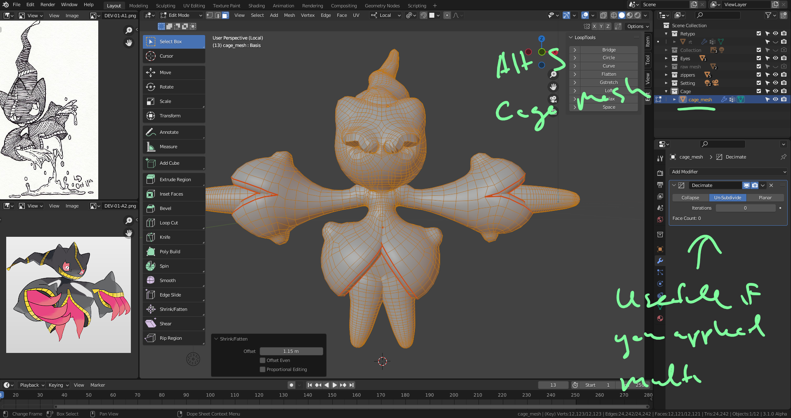
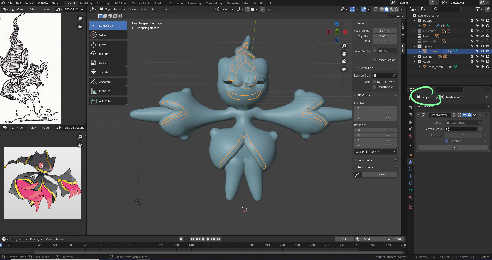
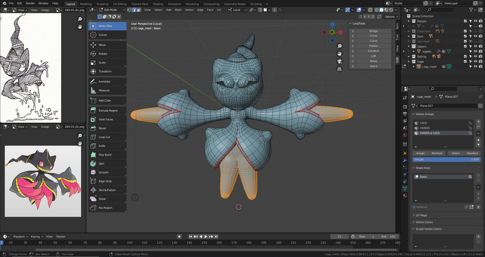
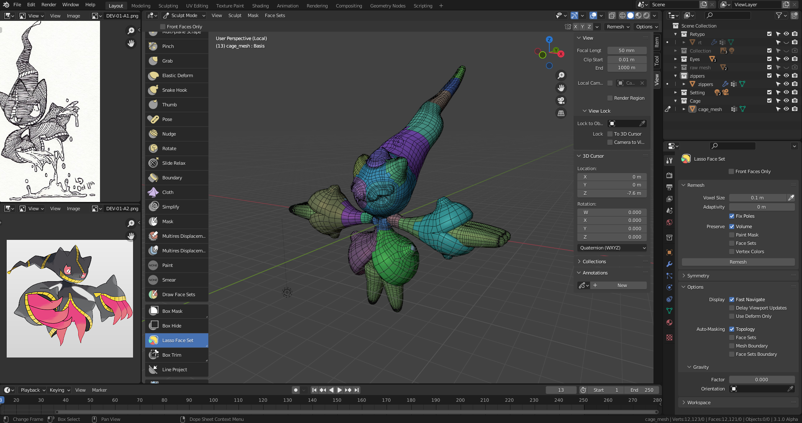
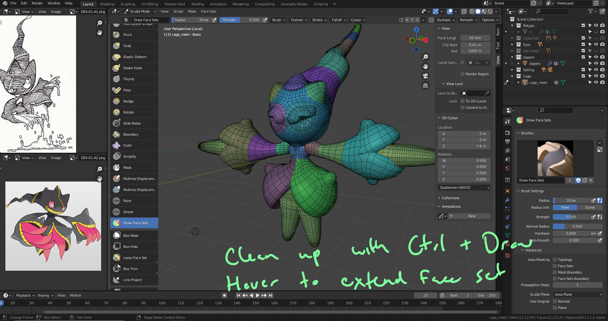
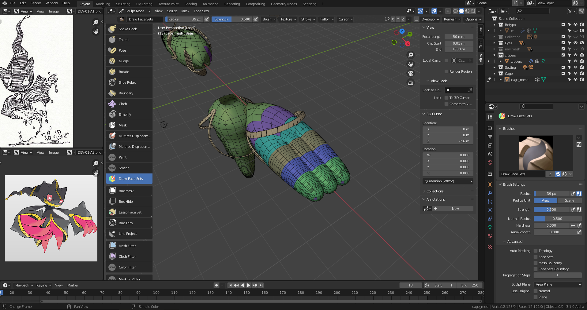
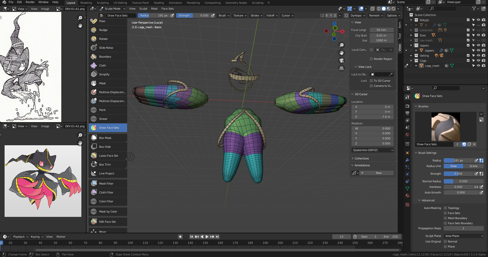
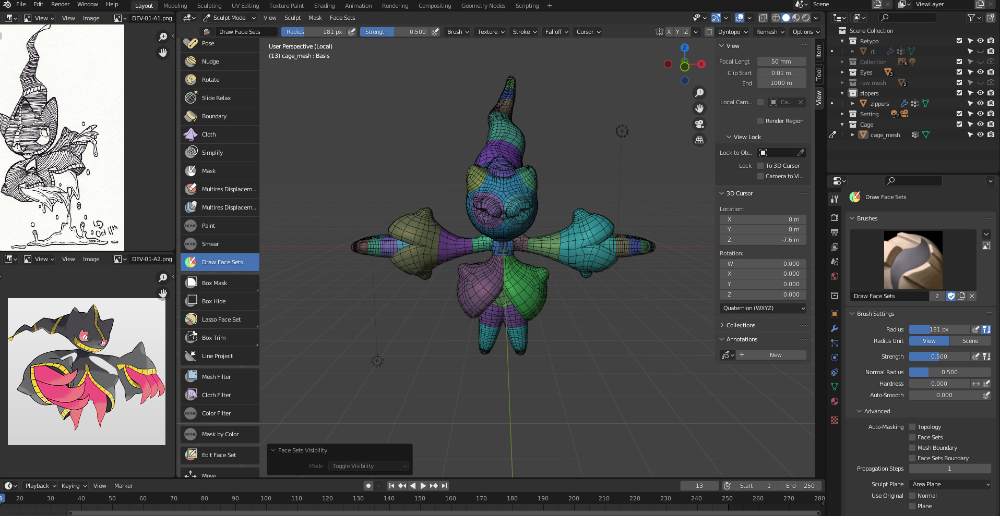

# DEV-07, Create the Cage Mesh and its Facesets
### Tags: []
### Link:[<>]

## Create Cage Mesh

  Make sure it surrounds the retypo and zippers

## Create Facesets in Cage Mesh

  Make sure the face sets are accurate in parts you cant see

